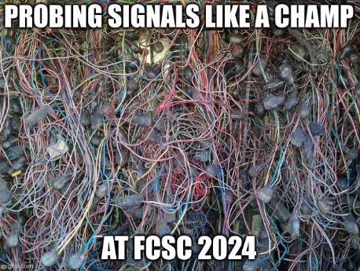

# FCSC 2024 Very Cute Data

Ce challenge a pour objectif de vous introduire à l’analyse de capture de signaux électroniques numériques à l’analyseur logique. La capture qui vous est fournie est au format *vcd* (pour Value Change Dump). Vous pouvez l’ouvrir avec les logiciels *pulseview* ou *GTKWave* pour une visualisation des signaux. Vous pouvez également utiliser la bibliothèque Python *pyDigitalWaveTools.vcd* pour manipuler ces fichiers (d’autres bibliothèques existent aussi).

La capture est constituée de deux signaux numériques *D0* et *D1* : le premier correspond à des données binaires, le second est une horloge. Dans beaucoup de protocoles de bus de communication, les signaux numériques représentent des données échantillonnées (“samplées”) sur des fronts d’horloge : cette épreuve va vous permettre de vous familiariser avec ce concept. Le signal de données qui nous intéresse ici, à savoir *D0*, est échantillonné sur les **fronts descendants de l’horloge** : lorsque *D1* passe de 1 à 0, l’état de *D0* correspond à la valeur à retenir à cet échantillon temporel.

On vous demande d’extraire le binaire contenu entre l’échantillon à 350 micro secondes et l’échantillon à 2000 micro secondes. Le résultat est une chaîne de bits B qu’il faudra fournir sous forme *FCSC{B}* comme flag. A titre d’exemple, le sampling entre l’échantillon à 0 et l’échantillon à 350 micro secondes fournirait *FCSC{1000100010}*.

Nous vous conseillons fortement d’automatiser cette extraction, cela vous sera très utile pour certaines autres épreuves de la catégorie hardware !

Auteurs : rbe

Origine : [Very Cute Data](https://hackropole.fr/fr/challenges/hardware/fcsc2024-hardware-very-cute-data/)

Fichiers :
- [very-cute-data.vcd](very-cute-data.vcd)

-----------

## Installation manuel
Vous n'utilisez pas l'application **les CTFs de Cyrhades** ? C'est dommage !
Mais voici comment installer ce CTF manuellement :

> git clone https://github.com/Hack-Oeil/fcsc2024-hardware-very-cute-data.git

> cd fcsc2024-hardware-very-cute-data

-----------

## Sur le site officiel hackropole.fr
> https://hackropole.fr/fr/challenges/hardware/fcsc2024-hardware-very-cute-data/